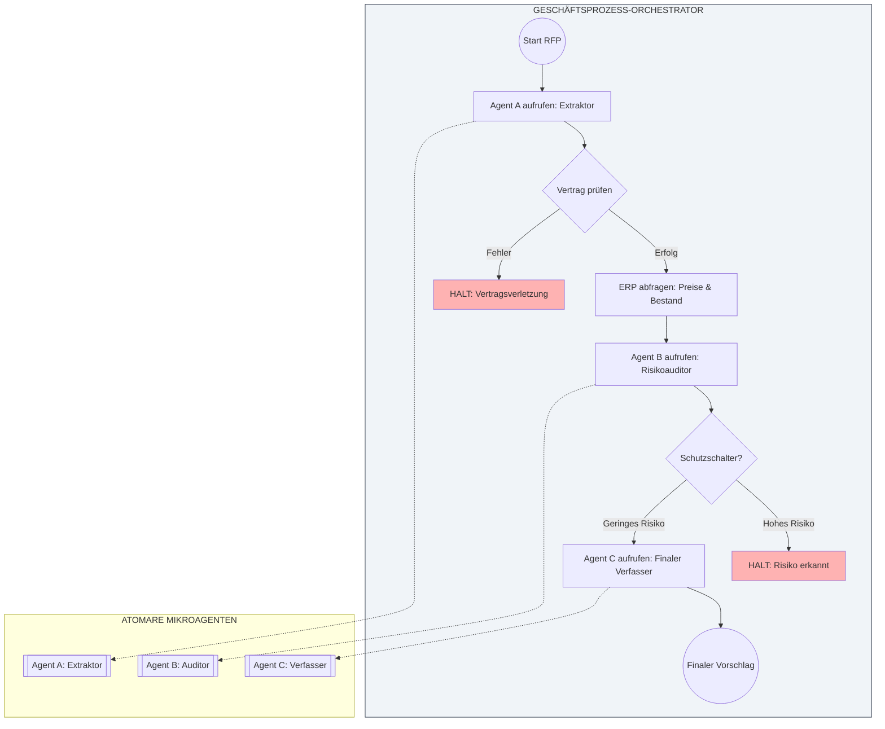

# DAS MANIFEST DES MICROAGENTIC STACKING

> Hinweis: Diese Übersetzung wurde automatisch von Gemini 3 erstellt.

## Von Prompt-Alchemie zu skalierbarem Software-Engineering

## 1. Präambel: Das Ende des Monolithen

Wir erleben den Zusammenbruch des „Prompt Engineering“ als isolierte Disziplin. Der Versuch, komplexe Geschäftsprozesse durch eine einzige riesige Anweisung an ein Basismodell (LLM) zu lösen, hat sich als fragile, unvorhersehbare Strategie erwiesen, die im Unternehmensmaßstab unmöglich zu prüfen ist.

Die akademische Forschung bestätigte bereits 2023, dass die Behandlung von LLMs als monolithische Black Boxes für komplexe Aufgaben eine Sackgasse war [7]. Heute bestätigen führende Institutionen wie die UC Berkeley, dass der Stand der Technik nicht mehr mit größeren Einzelmodellen erreicht wird, sondern mit „Compound AI Systems“, die mehrere Komponenten orchestrieren [13], ein Trend, der durch aufkommende Architekturmuster validiert wird, die in der Industrie von führenden Firmen wie a16z beobachtet werden [15].

KI ist keine Magie; sie ist probabilistische Berechnung. Als solche muss sie denselben Ingenieursdisziplinen unterzogen werden, die es Software seit Jahrzehnten ermöglichen zu skalieren: Entkopplung, Modularität und strikte Verträge. Die Zukunft der KI liegt nicht in größeren Prompts, sondern in besserer Systemarchitektur [10].

Wir schlagen einen radikalen Paradigmenwechsel vor: Hören Sie auf, monolithische Chatbots zu bauen, und beginnen Sie, zusammengesetzte Architekturen zu orchestrieren.

Wir nennen diesen Standard **Microagentic Stacking (MAS)**.

## 2. Kernphilosophie

Unsere Methodik zielt nicht darauf ab, künstliche allgemeine Intelligenz (AGI) zu schaffen. Sie zielt darauf ab, robuste Unternehmenssysteme durch die Orchestrierung spezialisierter kognitiver Einheiten aufzubauen.

Wir basieren auf drei nicht verhandelbaren Säulen:

1. **Prozess über KI:** Die KI definiert nicht den Workflow; der Geschäftsprozess definiert, wo und wie KI eingesetzt wird.
2. **Atomarität über Allgemeinheit:** Kognitive Komplexität wird gelöst, indem sie in ihre kleinsten und unteilbaren Komponenten zerlegt wird.
3. **Inkrementelles Wachstum:** Systeme werden nicht „fertig“ entworfen; sie entwickeln sich Schicht für Schicht, Prozess für Prozess, von einem einfachen MVP zu einem komplexen Ökosystem.

## 3. Die technischen Prinzipien von MAS

Um ein MAS-System zu implementieren, müssen die folgenden Architekturgesetze befolgt werden, die von jahrzehntelangen soliden Software-Engineering-Prinzipien geerbt wurden:

### I. Das Gesetz des atomaren Mikroagenten (Single Responsibility)

Ein Mikroagent muss eine einzelne kognitive Aufgabe ausführen und diese perfekt ausführen. Dies ist die direkte Anwendung des Single Responsibility Principle (SRP) auf KI-Komponenten [2]. Wenn ein Agent versucht, „nach Informationen zu suchen, sie zu analysieren und eine Antwort zu schreiben“, ist er schlecht konzipiert. Er muss in drei verschiedene Agenten unterteilt werden.

### II. Black-Box-Isolation (Das Black-Box-Prinzip)

Die interne Funktionsweise eines Mikroagenten ist absolut privat und für den Rest des Systems unzugänglich, gemäß den Prinzipien des Microservices-Designs und begrenzter Kontexte [1].

* Der Orchestrator weiß nicht, welcher Prompt intern verwendet wird.
* Der Orchestrator weiß nicht, welches Modell (GPT-4, Claude, lokales Llama 3) die Aufgabe ausführt.

Diese Abstraktion ermöglicht Refactoring, Kostenoptimierung und den Wechsel von Modellen innerhalb eines Agenten, ohne den übergeordneten Prozess zu unterbrechen.

### III. Radikale Entkopplung und Verträge (Decoupling via Schema)

Mikroagenten sind untereinander agnostisch. Sie unterliegen der Methodik „Design by Contract“, bei der Vor- und Nachbedingungen strikt sind [3].

* **Strenge Verträge:** Jeder Agent definiert streng, welche Daten er akzeptiert (Input Schema) und welche Daten er zurückgibt (Output Schema) unter Verwendung von Standardformaten (z. B. JSON Schema, Pydantic).
* **Der Orchestrator als Transformator:** Es liegt in der ausschließlichen Verantwortung des Geschäftsprozesses (des Orchestrators), die Ausgabe von Agent A zu nehmen, die Daten bei Bedarf zu transformieren oder abzubilden und sie in Agent B einzuspeisen, wobei dessen Vertrag erfüllt wird.

### IV. Hierarchische und komponierbare Orchestrierung

Agenten sind die Teile, aber der Wert liegt in der Montage. Komplexe Intelligenz entsteht nicht aus einem einzigen Modell, sondern aus der Koordination mehrerer Teile [4].

* **Prozesse, die Agenten aufrufen:** Ein Workflow orchestriert eine Sequenz von Mikroagenten.
* **Prozesse, die Prozesse aufrufen:** Ein High-Level-Prozess kann einen anderen Prozess aufrufen, als wäre er nur ein weiterer Agent, was eine unendliche rekursive Komposition ermöglicht.

### V. Das Gesetz der Geschäftsprozess-Orchestrierung (BPO)

Der Orchestrator ist der Meister des Prozesses. Er ist die einzige Komponente, die den gesamten Kontext der Operation kennt. Er ist die einzige Komponente, die Entscheidungen auf der Grundlage des vollständigen Kontexts der Operation treffen kann.

## 4. Die Enterprise-Governance-Vereinbarung

KI-Autonomie innerhalb eines Unternehmens erfordert strikte Kontrolle. MAS ist nicht nur Code; es ist ein Rahmenwerk für Verantwortung und Robustheit. ML-Engineering-Experten haben wiederholt darauf hingewiesen, dass die Lücke zwischen einer Demo und einem System in der Produktion im Mangel an technischer Strenge, Bewertung und Risikokontrolle liegt [14]. Beweise zeigen, dass die Robustheit drastisch abnimmt, wenn unkontrollierte Autonomie zunimmt [8].

### 1. Atomare Rechenschaftspflicht (Atomic AccountabilEinen "Systemfehler" gibt es nicht. Jeder generierte Output muss eine unveränderliche Trace-Signatur tragen, die identifiziert, welcher spezifische Mikroagent, welche Version des Prompts und welches genaue Modell ihn generiert hat, für eine sofortige forensische Prüfung

### 2. Unveränderlichkeit und Versionierung (Prompt SemVer)

Ein Prompt ist Code. Er muss unter Versionskontrolle stehen. Jede Änderung an einer internen Anweisung, so klein sie auch sein mag, stellt eine neue unveränderliche Version des Agenten dar (z. B. v1.0.0 für kleinere Textanpassungen, v2.0.0 für Modellwechsel oder Logikänderungen). Es gibt keine "heißen" Änderungen in der Produktion.

### 3. Strikte Eingabevalidierung (Fail Fast)

Wir fungieren als strikte Zollkontrolle. Bevor ein Agent zu arbeiten beginnt, verifiziert das System automatisch, dass die Daten, die er empfangen soll, exakt seinem Eingabevertrag entsprechen. Wenn die Daten nicht zu 100 % passen, stoppt der Prozess sofort mit einem sichtbaren Fehler. Dieses „Fail Fast“-Muster ist für die Stabilität verteilter Systeme unerlässlich [5].

### 4. Minimales kontextuelles Privileg

Informationen unterliegen dem Prinzip „Need to know“. Kein Agent erhält den globalen Kontext der Operation, nur die Daten, die für seine Mikroaufgabe strikt notwendig sind. Dies ist kritisch, da gezeigt wurde, dass die Leistung von LLMs signifikant abnimmt, wenn sie mit irrelevantem Kontext überflutet werden („Lost in the Middle phenomenon“) [6].

### 5. Einheitsökonomie (FinOps at the Atomic Level)

Kosten müssen pro Einheit beobachtbar sein. Das System muss in der Lage sein, die genauen Ausführungskosten jedes einzelnen Mikroagenten zu melden.

## 5. Das Qualitätsrahmenwerk (Testing Framework)

Da LLMs probabilistisch sind, muss das Testen in MAS statistisch und mehrstufig sein.

* **Level 1: Unit Evals.** Jeder Mikroagent muss einen „Golden Dataset“ mit einer definierten statistischen Erfolgsschwelle (>95 %) bestehen, bevor er bereitgestellt wird.
* **Level 2: Vertragstests (Integration).** Wir validieren, dass die Teile mittels Mocking zusammenpassen. Wir stellen sicher, dass der Orchestrator Daten korrekt zwischen Agenten transformiert, ohne die Modelle ausführen zu müssen.
* **Level 3: Prozesstests (E2E).** Wir validieren, dass der komplette Geschäftsablauf funktionale und Latenzanforderungen erfüllt.

## 6. Die drei Dimensionen der Skalierbarkeit

Im monolithischen Paradigma ist Skalierung teuer und fragil. In MAS ist Skalierbarkeit eine natürliche Folge der Architektur.

### I. Technische Skalierbarkeit: „Stateless by Design“

Unsere Mikroagenten sind zustandslose (stateless) Ausführungseinheiten. Dies ermöglicht die Bereitstellung von einfachen Architekturen bis hin zu warteschlangenbasierten asynchronen Systemen (Event-Driven), um massive Lastspitzen zu bewältigen, ohne die interne Logik der Agenten ändern zu müssen.

### II. Kognitive Skalierbarkeit: „Teile und herrsche“

Wir vermeiden die kognitive Verschlechterung langer Kontexte [6]. Um komplexere Probleme zu lösen, erweitern wir den Kontext nicht; wir fügen der Kette mehr spezialisierte Agenten hinzu. Wir bewahren konstante Zuverlässigkeit unabhängig von der Problemkomplexität.

### III. Organisatorische Skalierbarkeit: Modulare Entwicklung

Wir brechen den Entwicklungsflaschenhals. Dank strikter Verträge und Black Boxes können mehrere Teams parallel an verschiedenen Mikroagenten arbeiten, diese optimieren und bereitstellen, ohne Codekonflikte und ohne das Ökosystem zu stoppen.

## 7. Referenzarchitektur: Die RFP-Engine

Um die Robustheit von Microagentic Stacking in einer kritischen Umgebung zu demonstrieren, analysieren wir die logische Architektur eines automatisierten Request for Proposal (RFP) Response Systems. Dieser Prozess erfordert eine strikte Trennung zwischen logischem Denken (KI) und Geschäftsdaten (SQL). Die Industrie bewegt sich hin zu Modellen, bei denen die Orchestrierung durch explizite Zustandsmaschinen und nicht durch autonome Schleifen verwaltet wird [9].

### Der mikroagentische Stack

* **Orchestrator (State Machine):** Der Kern des Systems. Es ist keine KI. Es ist eine Workflow-Engine, die den Ausschreibungsstatus verwaltet und den Datenverkehr zwischen Agenten und Datenbanken lenkt.
* **Mikroagent A (Extraktor):** Empfängt Rohtext aus dem PDF. Seine einzige Mission ist es, ein strukturiertes JSON mit technischen Anforderungen zurückzugeben. Er äußert keine Meinung, er extrahiert nur.
* **Integrationsschicht (Legacy):** Der Orchestrator nimmt die von Agent A extrahierten IDs und fragt das ERP ab, um Preise und Bestand zu erhalten. Schlüsselprinzip: KI erfindet niemals Preise.
* **Mikroagent B (Risikoauditor):** Empfängt Rechtsklauseln. Wenn er inakzeptable Risiken erkennt, aktiviert er einen „Schutzschalter“ (Circuit Breaker) [5] und der Orchestrator stoppt den Prozess vor dem Entwurf.
* **Mikroagent C (Finaler Verfasser):** Wird nur aktiviert, wenn vorherige Schritte gültig sind. Generiert den Vorschlag ausschließlich unter Verwendung der „sauberen Daten“, die der Orchestrator bereitstellt.

## 8. Fazit: Evolution als Standard

Microagentic Stacking ist keine statische Lösung; es ist eine Methodik für kontinuierliches Wachstum. Es ermöglicht den Start mit einem einfachen MVP und die Entwicklung zu komplexen Ökosystemen, wobei Fähigkeiten hinzugefügt und einzelne Komponenten optimiert werden, ohne Risiko einer Regression. Die Entwicklungsgemeinschaft im Großen und Ganzen übernimmt diesen Übergang von Monolithen zu agentischen Workflows als neues Paradigma der Workload-Migration [12].

Wir lehnen Chaos ab. Wir begrüßen Struktur.
**Wir bauen keine Demos. Wir bauen Architektur.**

**Hauptautor & Betreuer:** Eric Mora Juan (<ericmora82@gmail.com>)
**Veröffentlicht:** Januar 2026
Dies ist ein lebendiger Standard. Beiträge der Community sind willkommen.
Übernehmen Sie diesen Standard, indem Sie das MAS-Ready-Abzeichen zu Ihrem Repository hinzufügen.

## Referenzen

### Grundlagen des Software-Engineerings

1. Newman, S. (2021). Building Microservices: Designing Fine-Grained Systems (2nd Ed.). O'Reilly Media.
2. Martin, R. C. (2017). Clean Architecture: A Craftsman's Guide to Software Structure and Design. Prentice Hall.
3. Meyer, B. (1992). "Applying 'Design by Contract'". Computer, 25(10), 40-51. IEEE. Link: [https://ieeexplore.ieee.org/document/161279](https://ieeexplore.ieee.org/document/161279)
4. Hohpe, G., & Woolf, B. (2003). Enterprise Integration Patterns: Designing, Building, and Deploying Messaging Solutions. Addison-Wesley.
5. Nygard, M. T. (2018). Release It!: Design and Deploy Production-Ready Software (2nd Ed.). Pragmatic Bookshelf.

### KI-Systemforschung und Architektur (Stand der Technik)

1. Liu, N. F., et al. (2023). "Lost in the Middle: How Language Models Use Long Contexts". arXiv preprint arXiv:2307.03172. Link: [https://arxiv.org/abs/2307.03172](https://arxiv.org/abs/2307.03172)
2. Khattab, O., et al. (Stanford NLP) (2023). "DSPy: Compiling Declarative Language Model Calls into Self-Improving Pipelines". arXiv preprint arXiv:2310.03714. Link: [https://arxiv.org/abs/2310.03714](https://arxiv.org/abs/2310.03714)
3. Wang, L., et al. (2024). "On the Robustness of Large Language Models for Agentic Tasks". arXiv preprint arXiv:2402.05818. Link: [https://arxiv.org/abs/2402.05818](https://arxiv.org/abs/2402.05818)
4. LangChain Team (2024). "LangGraph: Building Language Agents as Graphs". LangChain Blog. Link: [https://blog.langchain.dev/langgraph/](https://blog.langchain.dev/langgraph/)
5. Husain, H. (2023). "AI Engineering is the New Software Engineering". Hamel's Blog. Link: [https://hamel.dev/blog/posts/ai-eng-is-new-sw-eng/](https://hamel.dev/blog/posts/ai-eng-is-new-sw-eng/)
6. Shopify Engineering (2024). "How Shopify Uses LLMs for Commerce". Shopify Engineering Blog.
7. Daga, D. (Medium). "From Monoliths to Agentic Workflows: The New Paradigm of Workload Migration". Link: [https://medium.com/@dagadeepansh/from-monoliths-to-agentic-workflows-the-new-paradigm-of-workload-migration-6f503f3837cc](https://medium.com/@dagadeepansh/from-monoliths-to-agentic-workflows-the-new-paradigm-of-workload-migration-6f503f3837cc)
8. Berkeley Artificial Intelligence Research (BAIR) (2024). "The Shift from Models to Compound AI Systems". BAIR Blog. Link: [https://bair.berkeley.edu/blog/2024/02/18/compound-ai-systems/](https://bair.berkeley.edu/blog/2024/02/18/compound-ai-systems/)
9. Huyen, C. (2023). "Building LLM applications for production". Chip Huyen's Blog. Link: [https://huyenchip.com/2023/04/11/llm-engineering.html](https://huyenchip.com/2023/04/11/llm-engineering.html)
10. Andreessen Horowitz (a16z) (2023/2024). "Emerging Architectures for LLM Applications". a16z Technology Blog. Link: [https://a16z.com/emerging-architectures-for-llm-applications/](https://a16z.com/emerging-architectures-for-llm-applications/)

### Aktueller Branchenkonsens (2025)

1. Forrester Research (2025). "The Agentic AI Reality Check: Why Governance and Orchestration Will Define the Next Era of Enterprise Automation." (Tech Trends Report).
