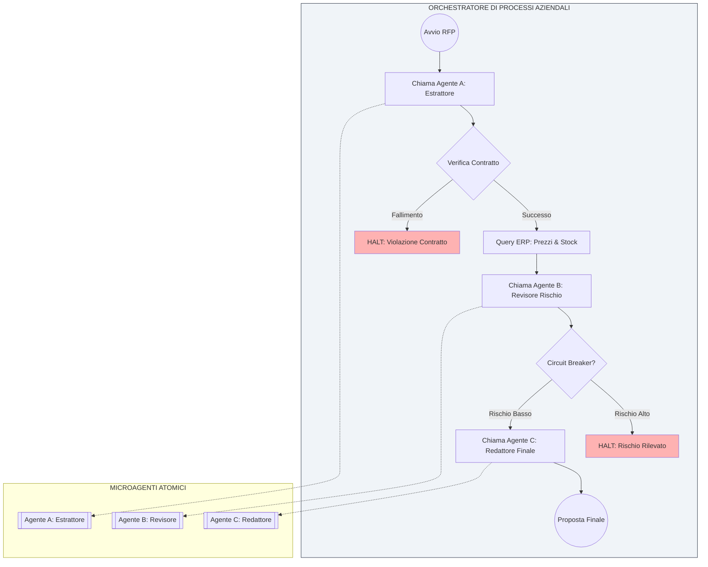

# IL MANIFESTO DEL MICROAGENTIC STACKING

> Nota: Questa traduzione è stata generata automaticamente da Gemini 3.

## Dall'Alchimia dei Prompt all'Ingegneria del Software Scalabile

## 1. Preambolo: La Fine del Monolite

Stiamo assistendo al crollo del "Prompt Engineering" come disciplina isolata. Il tentativo di risolvere processi aziendali complessi attraverso un'unica gigantesca istruzione a un modello fondazionale (LLM) si è rivelato una strategia fragile, imprevedibile e impossibile da verificare su scala aziendale.

La ricerca accademica ha confermato già nel 2023 che trattare gli LLM come scatole nere monolitiche per compiti complessi era un vicolo cieco [7]. Oggi, istituzioni leader come la UC Berkeley ratificano che lo stato dell'arte non si raggiunge più con modelli individuali più grandi, ma con "Sistemi di IA Compositi" che orchestrano più componenti [13], una tendenza convalidata dai modelli architettonici emergenti osservati nel settore da aziende leader come a16z [15].

L'IA non è magia; è calcolo probabilistico. Come tale, deve sottostare alle stesse discipline ingegneristiche che hanno permesso al software di scalare per decenni: disaccoppiamento, modularità e contratti rigorosi. Il futuro dell'IA non risiede in prompt più grandi, ma in una migliore architettura di sistema [10].

Proponiamo un cambiamento di paradigma radicale: smettere di costruire chatbot monolitici e iniziare a orchestrare architetture composite.

Chiamiamo questo standard **Microagentic Stacking (MAS)**.

## 2. Filosofia Fondamentale

La nostra metodologia non cerca di creare Intelligenza Artificiale Generale (AGI). Cerca di costruire sistemi aziendali robusti attraverso l'orchestrazione di unità cognitive specializzate.

Ci basiamo su tre pilastri non negoziabili:

1. **Processo sopra l'IA:** L'IA non definisce il flusso di lavoro; il processo aziendale definisce dove e come viene utilizzata l'IA.
2. **Atomicità sopra Generalità:** La complessità cognitiva viene risolta scomponendola nei suoi componenti più piccoli e indivisibili.
3. **Crescita Incrementale:** I sistemi non sono progettati "finiti"; si evolvono strato dopo strato, processo dopo processo, da un semplice MVP a un ecosistema complesso.

## 3. I Principi Tecnici del MAS

Per implementare un sistema MAS, devono essere rispettate le seguenti leggi architettoniche, ereditate da decenni di solidi principi di ingegneria del software:

### I. La Legge del Microagente Atomico (Responsabilità Singola)

Un Microagente deve eseguire un singolo compito cognitivo ed eseguirlo perfettamente. Questa è l'applicazione diretta del principio di responsabilità singola (SRP) ai componenti AI [2]. Se un agente cerca di "cercare informazioni, analizzarle e scrivere una risposta", è progettato male. Deve essere diviso in tre agenti distinti.

### II. Isolamento Black Box (Il Principio della Scatola Nera)

Il funzionamento interno di un Microagente è assolutamente privato e inaccessibile al resto del sistema, seguendo i principi di progettazione dei microservizi e i contesti delimitati [1].

* L'orchestratore non sa quale prompt viene utilizzato internamente.
* L'orchestratore non sa quale modello (GPT-4, Claude, Llama 3 locale) esegue il compito.

Questa astrazione consente il refactoring, l'ottimizzazione dei costi e la modifica dei modelli all'interno di un agente senza interrompere il processo superiore.

### III. Disaccoppiamento Radicale e Contratti (Decoupling via Schema)

I microagenti sono agnostici tra loro. Sono governati dalla metodologia "Design by Contract", dove le precondizioni e le postcondizioni sono rigorose [3].

* **Contratti Rigidi:** Ogni agente definisce rigorosamente quali dati accetta (Input Schema) e quali restituisce (Output Schema) utilizzando formati standard (ad es., JSON Schema, Pydantic).
* **L'Orchestratore come Trasformatore:** È responsabilità esclusiva del Processo Aziendale (l'orchestratore) prendere l'output dell'Agente A, trasformare o mappare i dati se necessario e iniettarli nell'Agente B rispettando il suo contratto.

### IV. Orchestrazione Gerarchica e Componibile

Gli agenti sono i pezzi, ma il valore è nell'assemblaggio. L'intelligenza complessa non emerge da un singolo modello, ma dal coordinamento di più parti [4].

### V. La Legge dell'Orchestrazione dei Processi di Business (BPO)

L'orchestratore è il maestro del processo. È l'unico componente che conosce il contesto completo dell'operazione. È l'unico componente che può prendere decisioni basate sul contesto completo dell'operazione.

## 4. L'Accordo di Governance Aziendale

L'autonomia dell'IA all'interno di un'azienda richiede un controllo rigoroso. MAS non è solo codice; è un quadro di responsabilità e robustezza. Gli esperti di ingegneria ML hanno ripetutamente sottolineato che il divario tra una demo e un sistema in produzione risiede nella mancanza di rigore ingegneristico, valutazione e controllo del rischio [14]. Le prove mostrano che la robustezza diminuisce drasticamente all'aumentare dell'autonomia incontrollata [8].

### 1. Responsabilità Atomica (Atomic Accountability)

L'errore "di sistema" non esiste. Ogni output generato deve portare una firma di traccia immutabile che identifichi quale microagente specifico, quale versione del prompt e quale modello esatto lo ha generato per un audit forense immediato.

### 2. Immutabilità e Versioning (Prompt SemVer)

Un prompt è codice. Deve essere sotto controllo di versione. Qualsiasi modifica a un'istruzione interna, per quanto piccola, costituisce una nuova versione immutabile dell'agente (es., v1.0.0 per modifiche minori al testo, v2.0.0 per cambio di modello o logica). Non ci sono modifiche "a caldo" in produzione.

### 3. Validazione Rigorosa dell'Input (Fail Fast)

Agiamo come un rigoroso controllo doganale. Prima che un agente inizi a lavorare, il sistema verifica automaticamente che i dati che sta per ricevere siano esattamente conformi al suo contratto di input. Se i dati non corrispondono al 100%, il processo si interrompe immediatamente con un errore visibile. Questo modello "Fail Fast" è essenziale per la stabilità del sistema distribuito [5].

### 4. Privilegio Contestuale Minimo

Le informazioni sono governate dal principio del "need to know". Nessun agente riceve il contesto globale dell'operazione, solo i dati strettamente necessari per il suo micro-compito. Questo è fondamentale, poiché è stato dimostrato che le prestazioni degli LLM degradano significativamente quando inondati di contesto irrilevante ("fenomeno Lost in the Middle") [6].

### 5. Economia Unitaria (FinOps at the Atomic Level)

Il costo deve essere osservabile per unità. Il sistema deve essere in grado di riportare l'esatto costo di esecuzione di ogni singolo microagente.

## 5. Il Framework di Qualità (Testing Framework)

Poiché gli LLM sono probabilistici, i test in MAS devono essere statistici e multilivello.

* **Livello 1: Valutazioni Unitarie (Unit Evals).** Ogni Microagente deve superare un "Golden Dataset" con una soglia di successo statistico definita (>95%) prima di essere distribuito.
* **Livello 2: Test del Contratto (Integration).** Convalidiamo che i pezzi si incastrino usando il Mocking. Ci assicuriamo che l'orchestratore stia trasformando correttamente i dati tra gli agenti senza dover eseguire i modelli.
* **Livello 3: Test di Processo (E2E).** Convalidiamo che il flusso aziendale completo soddisfi i requisiti funzionali e di latenza.

## 6. Le Tre Dimensioni della Scalabilità

Nel paradigma monolitico, la scalabilità è costosa e fragile. In MAS, la scalabilità è una conseguenza naturale dell'architettura.

### I. Scalabilità Tecnica: "Stateless by Design"

I nostri microagenti sono unità di esecuzione senza stato (stateless). Ciò consente di distribuire da architetture semplici a sistemi asincroni basati su code (Event-Driven) per gestire picchi di carico massicci, senza dover modificare la logica interna degli agenti.

### II. Scalabilità Cognitiva: "Divide et Impera"

Evitiamo il deterioramento cognitivo dei contesti lunghi [6]. Per risolvere problemi più complessi, non espandiamo il contesto; aggiungiamo più agenti specializzati alla catena. Manteniamo un'affidabilità costante indipendentemente dalla complessità del problema.

### III. Scalabilità Organizzativa: Sviluppo Modulare

Rompiamo il collo di bottiglia dello sviluppo. Grazie a contratti rigorosi e scatole nere, più team possono lavorare, ottimizzare e distribuire diversi microagenti in parallelo senza conflitti di codice e senza fermare l'ecosistema.

## 7. Architettura di Riferimento: Il Motore RFP

Per dimostrare la robustezza del Microagentic Stacking in un ambiente critico, analizziamo l'architettura logica di un sistema di risposta automatica alle richieste di proposta (RFP). Questo processo richiede una rigorosa separazione tra ragionamento (IA) e dati aziendali (SQL). L'industria si sta muovendo verso modelli in cui l'orchestrazione è gestita da macchine a stati esplicite, non da loop autonomi [9].

### Lo Stack Microagentico

* **Orchestratore (State Machine):** Il cuore del sistema. Non è IA. È un motore di flusso di lavoro che gestisce lo stato dell'appalto e dirige il traffico tra agenti e database.
* **Microagente A (Estrattore):** Riceve testo grezzo dal PDF. La sua unica missione è restituire un JSON strutturato di requisiti tecnici. Non esprime opinioni, estrae solo.
* **Livello di Integrazione (Legacy):** L'Orchestratore prende gli ID estratti dall'Agente A e interroga l'ERP per ottenere prezzi e scorte. Principio Chiave: L'IA non inventa mai i prezzi.
* **Microagente B (Revisore del Rischio):** Riceve clausole legali. Se rileva rischi inaccettabili, attiva un "Interruttore" (Circuit Breaker) [5] e l'orchestratore interrompe il processo prima della stesura.
* **Microagente C (Redattore Finale):** Si attiva solo se i passaggi precedenti sono validi. Genera la proposta utilizzando esclusivamente i "dati puliti" forniti dall'orchestratore.

## 8. Conclusione: L'Evoluzione come Standard

Microagentic Stacking non è una soluzione statica; è una metodologia per la crescita continua. Consente di iniziare con un semplice MVP ed evolversi in ecosistemi complessi, aggiungendo capacità e ottimizzando i singoli componenti senza rischio di regressione. La comunità di sviluppo in generale sta adottando questa transizione dai monoliti ai flussi di lavoro agentici come nuovo paradigma della migrazione del carico di lavoro [12].

Rifiutiamo il caos. Abbracciamo la struttura.
**Non costruiamo demo. Costruiamo architettura.**

**Autore Principale & Manutentore:** Eric Mora Juan (<ericmora82@gmail.com>)
**Pubblicato:** Gennaio 2026
Questo è uno standard vivente. I contributi della comunità sono benvenuti.
Adotta questo standard aggiungendo il badge MAS-Ready al tuo repository.

## Riferimenti

### Fondamenti di Ingegneria del Software

1. Newman, S. (2021). Building Microservices: Designing Fine-Grained Systems (2nd Ed.). O'Reilly Media.
2. Martin, R. C. (2017). Clean Architecture: A Craftsman's Guide to Software Structure and Design. Prentice Hall.
3. Meyer, B. (1992). "Applying 'Design by Contract'". Computer, 25(10), 40-51. IEEE. Link: [https://ieeexplore.ieee.org/document/161279](https://ieeexplore.ieee.org/document/161279)
4. Hohpe, G., & Woolf, B. (2003). Enterprise Integration Patterns: Designing, Building, and Deploying Messaging Solutions. Addison-Wesley.
5. Nygard, M. T. (2018). Release It!: Design and Deploy Production-Ready Software (2nd Ed.). Pragmatic Bookshelf.

### Ricerca e Architettura dei Sistemi IA (Stato dell'Arte)

1. Liu, N. F., et al. (2023). "Lost in the Middle: How Language Models Use Long Contexts". arXiv preprint arXiv:2307.03172. Link: [https://arxiv.org/abs/2307.03172](https://arxiv.org/abs/2307.03172)
2. Khattab, O., et al. (Stanford NLP) (2023). "DSPy: Compiling Declarative Language Model Calls into Self-Improving Pipelines". arXiv preprint arXiv:2310.03714. Link: [https://arxiv.org/abs/2310.03714](https://arxiv.org/abs/2310.03714)
3. Wang, L., et al. (2024). "On the Robustness of Large Language Models for Agentic Tasks". arXiv preprint arXiv:2402.05818. Link: [https://arxiv.org/abs/2402.05818](https://arxiv.org/abs/2402.05818)
4. LangChain Team (2024). "LangGraph: Building Language Agents as Graphs". LangChain Blog. Link: [https://blog.langchain.dev/langgraph/](https://blog.langchain.dev/langgraph/)
5. Husain, H. (2023). "AI Engineering is the New Software Engineering". Hamel's Blog. Link: [https://hamel.dev/blog/posts/ai-eng-is-new-sw-eng/](https://hamel.dev/blog/posts/ai-eng-is-new-sw-eng/)
6. Shopify Engineering (2024). "How Shopify Uses LLMs for Commerce". Shopify Engineering Blog.
7. Daga, D. (Medium). "From Monoliths to Agentic Workflows: The New Paradigm of Workload Migration". Link: [https://medium.com/@dagadeepansh/from-monoliths-to-agentic-workflows-the-new-paradigm-of-workload-migration-6f503f3837cc](https://medium.com/@dagadeepansh/from-monoliths-to-agentic-workflows-the-new-paradigm-of-workload-migration-6f503f3837cc)
8. Berkeley Artificial Intelligence Research (BAIR) (2024). "The Shift from Models to Compound AI Systems". BAIR Blog. Link: [https://bair.berkeley.edu/blog/2024/02/18/compound-ai-systems/](https://bair.berkeley.edu/blog/2024/02/18/compound-ai-systems/)
9. Huyen, C. (2023). "Building LLM applications for production". Chip Huyen's Blog. Link: [https://huyenchip.com/2023/04/11/llm-engineering.html](https://huyenchip.com/2023/04/11/llm-engineering.html)
10. Andreessen Horowitz (a16z) (2023/2024). "Emerging Architectures for LLM Applications". a16z Technology Blog. Link: [https://a16z.com/emerging-architectures-for-llm-applications/](https://a16z.com/emerging-architectures-for-llm-applications/)

### Consenso Industriale Recente (2025)

1. Forrester Research (2025). "The Agentic AI Reality Check: Why Governance and Orchestration Will Define the Next Era of Enterprise Automation." (Tech Trends Report).
