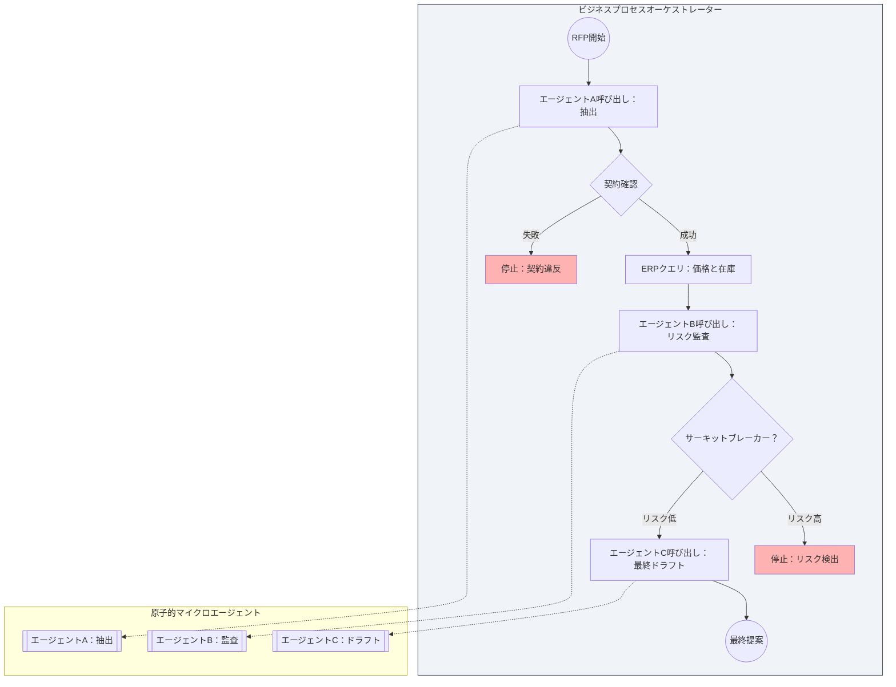

# マイクロエージェンティック・スタッキング宣言 (THE MICROAGENTIC STACKING MANIFESTO)

> 注意：この翻訳はGemini 3によって自動生成されました。

## プロンプトの錬金術からスケーラブルなソフトウェアエンジニアリングへ

## 1. 前文：モノリスの終焉

私たちは、孤立した規律としての「プロンプトエンジニアリング」の崩壊を目の当たりにしています。基盤モデル（LLM）への単一の巨大な指示を通じて複雑なビジネスプロセスを解決しようとする試みは、脆弱で予測不可能な戦略であり、エンタープライズ規模での監査が不可能であることが証明されました。

学術研究は2023年の時点で、複雑なタスクのためにLLMをモノリシックなブラックボックスとして扱うことは行き止まりであることを確認しました [7]。今日、カリフォルニア大学バークレー校のような主要機関は、最先端技術はもはやより大きな個々のモデルではなく、複数のコンポーネントをオーケストレーションする「複合AIシステム（Compound AI Systems）」によって達成されると批准しています [13]。この傾向は、a16zのような主要企業によって業界で観察される新しいアーキテクチャパターンによって検証されています [15]。

AIは魔法ではありません。確率的な計算です。そのため、デカップリング、モジュール性、厳格な契約など、ソフトウェアが何十年にもわたってスケールすることを可能にしてきたのと同じエンジニアリング規律を受ける必要があります。AIの未来は、より大きなプロンプトにあるのではなく、より優れたシステムアーキテクチャにあります [10]。

私たちは根本的なパラダイムシフトを提案します。モノリシックなチャットボットの構築をやめ、複合アーキテクチャのオーケストレーションを開始することです。

私たちはこの標準を **マイクロエージェンティック・スタッキング（Microagentic Stacking / MAS）** と呼びます。

## 2. コア哲学

私たちの方法論は、汎用人工知能（AGI）を作成しようとするものではありません。専門化された認知ユニットのオーケストレーションを通じて、堅牢なエンタープライズシステムを構築しようとするものです。

私たちは3つの交渉不可能な柱に基づいています：

1. **AIよりプロセスを優先:** AIがワークフローを定義するのではなく、ビジネスプロセスがAIの使用場所と方法を定義します。
2. **汎用性より原子性:** 認知的な複雑さは、それを最小かつ分割不可能なコンポーネントに分解することで解決されます。
3. **段階的な成長:** システムは「完成品」として設計されません。単純なMVPから複雑なエコシステムへと、レイヤーごと、プロセスごとに進化します。

## 3. MASの技術的原則

MASシステムを実装するには、数十年にわたる健全なソフトウェアエンジニアリングの原則から継承された、以下のアーキテクチャの法則に従う必要があります。

### I. 原子的マイクロエージェントの法則（単一責任）

マイクロエージェントは、単一の認知タスクを実行し、それを完璧に実行する必要があります。これは、AIコンポーネントへの単一責任の原則（SRP）の直接的な適用です [2]。エージェントが「情報を検索し、分析し、回答を書く」ことを試みる場合、それは設計が不十分です。3つの異なるエージェントに分割する必要があります。

### II. ブラックボックス分離（ブラックボックスの原則）

マイクロエージェントの内部動作は、マイクロサービス設計の原則と境界付けられたコンテキストに従い、システムの他の部分からは完全にプライベートでアクセス不可能です [1]。

* オーケストレーターは、内部でどのプロンプトが使用されているかを知りません。
* オーケストレーターは、どのモデル（GPT-4、Claude、ローカルLlama 3）がタスクを実行するかを知りません。

この抽象化により、上位プロセスを壊すことなく、エージェント内でのリファクタリング、コスト最適化、モデルの変更が可能になります。

### III. 徹底的なデカップリングと契約（スキーマによるデカップリング）

マイクロエージェントは互いに不可知です。それらは「契約による設計」方法論によって管理され、前提条件と事後条件が厳格です [3]。

* **厳格な契約 (Rigid Contracts):** 各エージェントは、標準フォーマット（例：JSON Schema, Pydantic）を使用して、受け入れるデータ（Input Schema）と返すデータ（Output Schema）を厳密に定義します。
* **トランスフォーマーとしてのオーケストレーター:** エージェントAからの出力を受け取り、必要に応じてデータを変換またはマッピングし、契約を満たすようにエージェントBに注入することは、ビジネスプロセス（オーケストレーター）の排他的な責任です。

### IV. 階層的で構成可能なオーケストレーション

エージェントは部品ですが、価値は組み立てにあります。複雑な知性は単一のモデルからではなく、複数の部分の調整から生まれます [4]。

* **エージェントを呼び出すプロセス:** ワークフローは一連のマイクロエージェントをオーケストレーションします。
* **プロセスを呼び出すプロセス:** 高レベルのプロセスは、別のプロセスをあくまで別のエージェントであるかのように呼び出し、無限の再帰的な構成を可能にします。

### V. ビジネスプロセスオーケストレーションの法則（BPO）

オーケストレーターはプロセスのマスターです。これは、操作の完全なコンテキストを知る唯一のコンポーネントです。これは、操作の完全なコンテキストに基づいて決定を下すことができる唯一のコンポーネントです。

## 4. エンタープライズガバナンス協定

企業内でのAIの自律性には厳格な管理が必要です。MASは単なるコードではありません。それは責任と堅牢性のフレームワークです。MLエンジニアリングの専門家は、デモと本番システムの違いは、エンジニアリングの厳格さ、評価、リスク管理の欠如にあると繰り返し指摘しています [14]。証拠は、制御されていない自律性が高まるにつれて堅牢性が劇的に低下することを示しています [8]。

### 1. 原子的説明責任 (Atomic Accountability)

「システムエラー」は存在しません。生成されたすべての出力には、どの特定のマイクロエージェント、どのバージョンのプロンプト、どの正確なモデルがそれを生成したかを特定する不変のトレース署名 (immutable trace signature) を含める必要があり、これにより即時のフォレンジック監査が可能になります。

### 2. 不変性とバージョニング (Prompt SemVer)

プロンプトはコードです。バージョン管理下にある必要があります。内部命令への変更は、どんなに些細なものであっても、エージェントの新しい不変バージョン（例：テキストの微修正にはv1.0.0、モデルの切り替えやロジックの変更にはv2.0.0）を構成します。本番環境での「ホット」な変更はありません。

### 3. 厳格な入力検証 (Fail Fast)

私たちは厳格な税関管理として機能します。エージェントが動作を開始する前に、システムは自動的に、受信しようとしているデータが入力契約に正確に準拠していることを検証します。データが100%適合しない場合、プロセスは目に見えるエラーですぐに停止します。この「Fail Fast（早期失敗）」パターンは、分散システムの安定性に不可欠です [5]。

### 4. 最小限のコンテキスト権限

情報は「知る必要のある（need to know）」原則によって管理されます。どのエージェントも操作のグローバルコンテキストを受け取らず、そのマイクロタスクに厳密に必要なデータのみを受け取ります。無関係なコンテキストで溢れるとLLMのパフォーマンスが大幅に低下することが示されているため（「Lost in the Middle現象」）、これは重要です [6]。

### 5. ユニットエコノミクス (FinOps at the Atomic Level)

コストは単位ごとに観察可能でなければなりません。システムは、個々のマイクロエージェントごとの正確な実行コストを報告できる必要があります。

## 5. 品質フレームワーク (Testing Framework)

LLMは確率的であるため、MASでのテストは統計的かつマルチレベルである必要があります。

* **レベル1：ユニット評価 (Unit Evals):** 各マイクロエージェントは、展開される前に、定義された統計的成功しきい値（>95%）を持つ「ゴールデンデータセット」に合格する必要があります。
* **レベル2：契約テスト（統合）:** モッキングを使用して、部品が適合することを検証します。モデルを実行する必要なく、オーケストレーターがエージェント間でデータを正しく変換していることを確認します。
* **レベル3：プロセステスト (E2E):** 完全なビジネスフローが機能要件とレイテンシ要件を満たしていることを検証します。

## 6. スケーラビリティの3つの次元

モノリシックなパラダイムでは、スケーリングは高価で脆弱です。MASでは、スケーラビリティはアーキテクチャの自然な結果です。

### I. 技術的スケーラビリティ：「設計によるステートレス」

私たちのマイクロエージェントは、ステートレス（無状態）な実行ユニットです。これにより、シンプルなアーキテクチャからキューベースの非同期システム（イベント駆動）まで展開し、エージェントの内部ロジックを変更することなく、大規模な負荷スパイクを管理できます。

### II. 認知的スケーラビリティ：「分割統治」

私たちは長いコンテキストによる認知機能の低下を避けます [6]。より複雑な問題を解決するために、コンテキストを拡張するのではなく、チェーンにより多くの専門化されたエージェントを追加します。問題の複雑さに関係なく、一定の信頼性を維持します。

### III. 組織的スケーラビリティ：モジュラー開発

私たちは開発のボトルネックを打破します。厳格な契約とブラックボックスのおかげで、複数のチームがコードの競合なしに、エコシステムを停止することなく、異なるマイクロエージェントを並行して作業、最適化、展開できます。

## 7. リファレンスアーキテクチャ：RFPエンジン

重要な環境におけるマイクロエージェンティック・スタッキングの堅牢性を実証するために、自動提案依頼書（RFP）応答システムの論理アーキテクチャを分析します。このプロセスには、推論（AI）とビジネスデータ（SQL）の厳格な分離が必要です。業界は、オーケストレーションが自律ループではなく明示的なステートマシンによって管理されるモデルへと移行しています [9]。

### マイクロエージェンティック・スタック

* **オーケストレーター（ステートマシン）:** システムの核。AIではありません。これは入札ステータスを管理し、エージェントとデータベース間のトラフィックを指示するワークフローエンジンです。
* **マイクロエージェントA（エクストラクター）:** PDFから生のテキストを受け取ります。その唯一の使命は、技術要件の構造化されたJSONを返すことです。意見を述べず、抽出するだけです。
* **統合レイヤー（レガシー）:** オーケストレーターはエージェントAによって抽出されたIDを取得し、ERPにクエリを実行して価格と在庫を取得します。主要原則：AIは決して価格を発明しません。
* **マイクロエージェントB（リスク監査人）:** 法的条項を受け取ります。許容できないリスクを検出した場合、「サーキットブレーカー」[5]をアクティブにし、オーケストレーターはドラフト作成前にプロセスを停止します。
* **マイクロエージェントC（最終ドラフター）:** 前のステップが有効な場合にのみアクティブになります。オーケストレーターが提供する「クリーンなデータ」のみを使用して提案を生成します。

重要な環境におけるマイクロエージェンティック・スタッキングの堅牢性を実証するために、自動提案依頼書（RFP）応答システムの論理アーキテクチャを分析します。このプロセスには、推論（AI）とビジネスデータ（SQL）の厳格な分離が必要です。業界は、オーケストレーションが自律ループではなく明示的なステートマシンによって管理されるモデルへと移行しています [9]。

### マイクロエージェンティック・スタック

* **オーケストレーター（ステートマシン）:** システムの核。AIではありません。これは入札ステータスを管理し、エージェントとデータベース間のトラフィックを指示するワークフローエンジンです。
* **マイクロエージェントA（エクストラクター）:** PDFから生のテキストを受け取ります。その唯一の使命は、技術要件の構造化されたJSONを返すことです。意見を述べず、抽出するだけです。
* **統合レイヤー（レガシー）:** オーケストレーターはエージェントAによって抽出されたIDを取得し、ERPにクエリを実行して価格と在庫を取得します。主要原則：AIは決して価格を発明しません。
* **マイクロエージェントB（リスク監査人）:** 法的条項を受け取ります。許容できないリスクを検出した場合、「サーキットブレーカー」[5]をアクティブにし、オーケストレーターはドラフト作成前にプロセスを停止します。
* **マイクロエージェントC（最終ドラフター）:** 前のステップが有効な場合にのみアクティブになります。オーケストレーターが提供する「クリーンなデータ」のみを使用して提案を生成します。

## 8. 結論：標準としての進化

マイクロエージェンティック・スタッキングは静的なソリューションではありません。それは継続的な成長のための方法論です。単純なMVPから始めて複雑なエコシステムへと進化させ、回帰のリスクなしに機能を追加し、個々のコンポーネントを最適化することができます。開発コミュニティ全体が、ワークロード移行の新しいパラダイムとして、モノリスからエージェンティックワークフローへのこの移行を採用しています [12]。

私たちはカオスを拒否します。私たちは構造を受け入れます。
**私たちはデモを作りません。私たちはアーキテクチャを作ります。**

**主執筆者 & メンテナー:** Eric Mora Juan (<ericmora82@gmail.com>)
**公開:** 2026年1月
これは生きた標準です。コミュニティからの貢献を歓迎します。
リポジトリにMAS-Readyバッジを追加して、この標準を採用してください。

## 参考文献

### ソフトウェアエンジニアリングの基礎

1. Newman, S. (2021). Building Microservices: Designing Fine-Grained Systems (2nd Ed.). O'Reilly Media.
2. Martin, R. C. (2017). Clean Architecture: A Craftsman's Guide to Software Structure and Design. Prentice Hall.
3. Meyer, B. (1992). "Applying 'Design by Contract'". Computer, 25(10), 40-51. IEEE. Link: [https://ieeexplore.ieee.org/document/161279](https://ieeexplore.ieee.org/document/161279)
4. Hohpe, G., & Woolf, B. (2003). Enterprise Integration Patterns: Designing, Building, and Deploying Messaging Solutions. Addison-Wesley.
5. Nygard, M. T. (2018). Release It!: Design and Deploy Production-Ready Software (2nd Ed.). Pragmatic Bookshelf.

### AIシステムの研究とアーキテクチャ（最先端技術）

1. Liu, N. F., et al. (2023). "Lost in the Middle: How Language Models Use Long Contexts". arXiv preprint arXiv:2307.03172. Link: [https://arxiv.org/abs/2307.03172](https://arxiv.org/abs/2307.03172)
2. Khattab, O., et al. (Stanford NLP) (2023). "DSPy: Compiling Declarative Language Model Calls into Self-Improving Pipelines". arXiv preprint arXiv:2310.03714. Link: [https://arxiv.org/abs/2310.03714](https://arxiv.org/abs/2310.03714)
3. Wang, L., et al. (2024). "On the Robustness of Large Language Models for Agentic Tasks". arXiv preprint arXiv:2402.05818. Link: [https://arxiv.org/abs/2402.05818](https://arxiv.org/abs/2402.05818)
4. LangChain Team (2024). "LangGraph: Building Language Agents as Graphs". LangChain Blog. Link: [https://blog.langchain.dev/langgraph/](https://blog.langchain.dev/langgraph/)
5. Husain, H. (2023). "AI Engineering is the New Software Engineering". Hamel's Blog. Link: [https://hamel.dev/blog/posts/ai-eng-is-new-sw-eng/](https://hamel.dev/blog/posts/ai-eng-is-new-sw-eng/)
6. Shopify Engineering (2024). "How Shopify Uses LLMs for Commerce". Shopify Engineering Blog.
7. Daga, D. (Medium). "From Monoliths to Agentic Workflows: The New Paradigm of Workload Migration". Link: [https://medium.com/@dagadeepansh/from-monoliths-to-agentic-workflows-the-new-paradigm-of-workload-migration-6f503f3837cc](https://medium.com/@dagadeepansh/from-monoliths-to-agentic-workflows-the-new-paradigm-of-workload-migration-6f503f3837cc)
8. Berkeley Artificial Intelligence Research (BAIR) (2024). "The Shift from Models to Compound AI Systems". BAIR Blog. Link: [https://bair.berkeley.edu/blog/2024/02/18/compound-ai-systems/](https://bair.berkeley.edu/blog/2024/02/18/compound-ai-systems/)
9. Huyen, C. (2023). "Building LLM applications for production". Chip Huyen's Blog. Link: [https://huyenchip.com/2023/04/11/llm-engineering.html](https://huyenchip.com/2023/04/11/llm-engineering.html)
10. Andreessen Horowitz (a16z) (2023/2024). "Emerging Architectures for LLM Applications". a16z Technology Blog. Link: [https://a16z.com/emerging-architectures-for-llm-applications/](https://a16z.com/emerging-architectures-for-llm-applications/)

### 最近の業界のコンセンサス (2025)

1. Forrester Research (2025). "The Agentic AI Reality Check: Why Governance and Orchestration Will Define the Next Era of Enterprise Automation." (Tech Trends Report).
